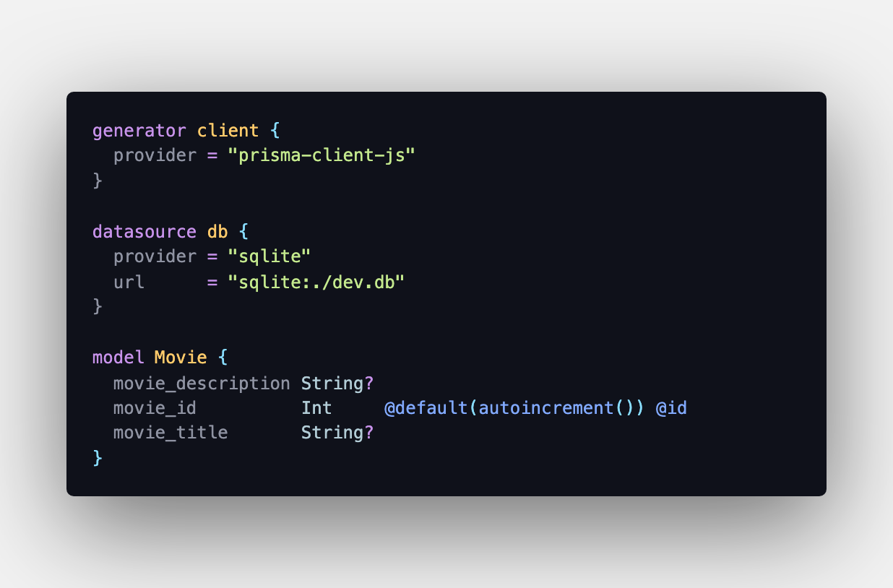
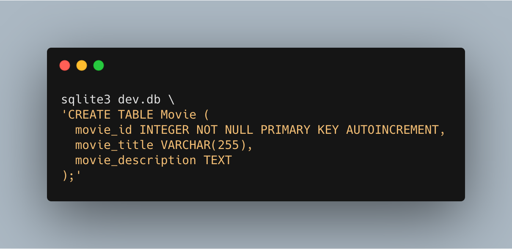
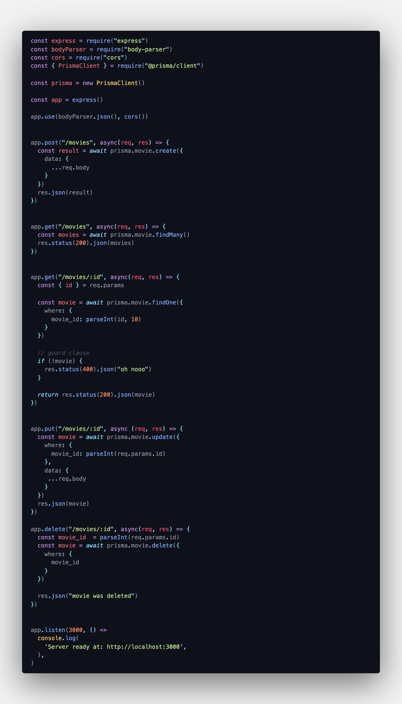

# prisma2

## REST API tools/libraries

start out by running the command
`npx prisma2 init`

It will create a prisma folder for you
with `schema.prisma` for you and a `.env`
file.

Start out by deleting `.env` file and removing everything in `schema.prisma` file and make it look like the image below

also make sure that you created an empty `dev.db` in the same folder as `schema.prisma`

You also have make sure that you have created a local sqlite database.

For installing sqlite on,

windows 
`choco install sqlite`

ubuntu
`sudo apt-get install sqlite3`

Mac
`brew install sqlite`

`cd` into the `prisma` directory then, run the following command in your terminal! 

Now you can run the `npx prisma2 generate` command

With that as well run the following command

`npm i express body-parser cors`

Create an `index.js` file and paste the following code,

